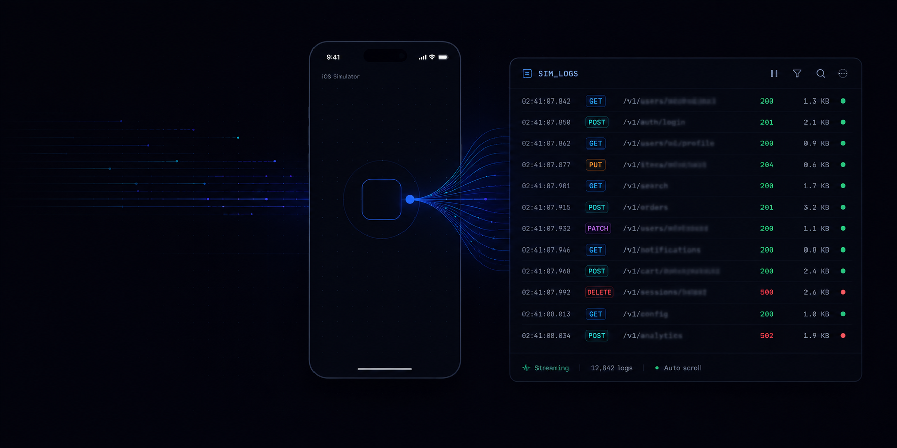

<p align="center">
  
</p>

# sim_logs

> **Live structured-log overlay for iOS Simulators *and* Android emulators.**
> Charles + Console.app + analytics inspector, in a borderless SwiftUI panel that snaps beside your sim/emulator window.

Three pieces, all independent:

| | |
|---|---|
| **`sim-console`** | macOS panel app. Borderless SwiftUI panel positioned beside the running iOS Simulator or Android emulator. Subscribes to `xcrun simctl spawn ... log stream` on iOS or `adb logcat` on Android and renders structured rows for analytics / network / metric / log events. |
| **`SimConsole` (iOS)** | Swift Package (iOS 15+). Drop-in SDK your app calls at runtime to emit structured events via `os.Logger`. The panel picks them up over the unified-log channel — no socket, no port, no extra runtime. |
| **`com.simconsole:simconsole` (Android)** | Kotlin AAR (minSdk 24). Same public API surface as the iOS SDK; emits via `android.util.Log` with stable `SimConsole.<category>` tags. Includes an OkHttp `Interceptor` for network capture and request mocking, plus background samplers for memory / CPU / FPS / hangs. |

All three pieces are independent. You can run `sim-console` against **any iOS or Android app** without integrating the SDK — you'll still get the Errors / All text tabs. Add the SDK and the Analytics / Network / Metrics tabs become a real Charles-style inspector with method, status, duration, headers, and request + response bodies.

---

## Why

You're running an iOS app on a simulator from the command line (or in CI), and you want:

- **Real-time visibility** into network calls — URL, method, status, duration, headers, body — without launching Charles, Proxyman, or a debugger.
- **Analytics event flow** without fishing in Amplitude/Firebase 30 seconds later — you want to see, *as you tap*, what event fired with what params.
- **Structured logs** that survive `os_log`'s redaction (`<private>` everywhere) and aren't lost in CFNetwork's firehose.
- **Anywhere** — beside any sim, any iOS app, any project. Bundle-id-only configuration.

If you've ever wished Xcode's debug console had a filter bar and a "Network" tab, this is that.

---

## Quickstart

### 1. Run the console beside any iOS simulator

```bash
git clone git@github.com:murilloarturo/sim_logs.git
cd sim_logs

# Build the macOS binary (one-time)
./Tools/build.sh

# Launch beside a booted simulator that has your app installed
./Tools/sim-console.sh <your-bundle-id>
```

On the first run, macOS will prompt for **Accessibility** permission for your terminal — that's how the console finds the simulator window's position. Grant it once.

The console auto-positions beside the simulator window, tracks it as you drag, and exits when Simulator.app quits.

### 2. (Optional) Add the SDK to your iOS app

In Xcode, **File → Add Packages → enter** `https://github.com/murilloarturo/sim_logs` and add the `SimConsole` library to your **Debug-only** target. Or in `Package.swift`:

```swift
.package(url: "https://github.com/murilloarturo/sim_logs", branch: "main")
```

Bootstrap at app launch:

```swift
import SimConsole

@main
struct MyApp: App {
    init() {
        #if DEBUG
        SimConsole.bootstrap(.init(
            subsystem: Bundle.main.bundleIdentifier ?? "com.example.app"
        ))
        #endif
    }
    // ...
}
```

For automatic URLSession capture, register the protocol on every `URLSessionConfiguration` you use:

```swift
#if DEBUG
let config = URLSessionConfiguration.default
config.protocolClasses = [SimConsoleURLProtocol.self] + (config.protocolClasses ?? [])
let session = URLSession(configuration: config)
#endif
```

For analytics, call directly wherever you fire events. Both the dictionary form and typed-model form are supported — they emit identical wire format:

```swift
// Dictionary form — quick and ergonomic
SimConsole.analytics(event: "purchase", params: ["sku": "premium_monthly", "price": 9.99])
SimConsole.screen("CheckoutScreen")
SimConsole.log("Cache miss", level: .info, fields: ["key": "user:profile"])

// Typed-model form — self-documenting, IDE-friendly
SimConsole.track(SimConsole.AnalyticsEvent(
    name: "purchase",
    params: ["sku": "premium_monthly", "price": 9.99]
))
```

Rebuild, launch on a simulator, and run `./Tools/sim-console.sh <your-bundle-id>` — the Analytics and Network tabs light up.

### 3. (Alternative) Use it against an Android emulator or USB device

```bash
# One-time: publish the Kotlin AAR to your local Maven repo
( cd android && ./gradlew :simconsole:publishToMavenLocal )
```

In your Android app's `settings.gradle.kts`:

```kotlin
dependencyResolutionManagement {
    repositories { mavenLocal(); google(); mavenCentral() }
}
```

In `app/build.gradle.kts`:

```kotlin
dependencies {
    debugImplementation("com.simconsole:simconsole:0.1.0")
    implementation("com.squareup.okhttp3:okhttp:5.3.2")
}
```

Bootstrap in `Application.onCreate()`:

```kotlin
import com.simconsole.SimConsole
import com.simconsole.SimConsoleInterceptor

class MyApp : Application() {
    override fun onCreate() {
        super.onCreate()
        if (BuildConfig.DEBUG) {
            SimConsole.bootstrap(this, subsystem = BuildConfig.APPLICATION_ID)
        }
    }
}

// In your OkHttpClient.Builder()
.apply { if (BuildConfig.DEBUG) addInterceptor(SimConsoleInterceptor()) }
```

Launch the panel:

```bash
./Tools/sim-console \
  --platform android --device emulator-5554 --tag "Android Emulator" \
  --bundle-id com.your.app \
  --tab "analytics|Analytics|SimConsole.analytics:V SimConsole.analytics.chunk:V *:S" \
  --tab "network|Network|SimConsole.network:V SimConsole.network.chunk:V *:S" \
  --tab "metric|Metrics|SimConsole.metric:V SimConsole.metric.chunk:V *:S" \
  --tab "text|Logs|SimConsole.event:V SimConsole.event.chunk:V *:S"
```

For USB-connected physical devices, append `--detached` (the panel becomes a movable floating window since there's no device window to dock against on the Mac).

---

## Use it with an agent (Claude Code skill)

If you use [Claude Code](https://claude.com/claude-code), `sim_logs` ships with a skill so any agent can install, integrate, and launch it for you:

```bash
git clone https://github.com/murilloarturo/sim_logs.git ~/Developer/sim_logs
~/Developer/sim_logs/Tools/install-skill.sh
```

That symlinks `.claude/skill/SKILL.md` into `~/.claude/skills/sim-console/`. Then in any Claude Code session:

| Command | What it does |
|---|---|
| `/sim-console install` | Clone (if missing) + build the macOS binary + publish the Android AAR to Maven Local. |
| `/sim-console integrate` | Auto-detects iOS vs Android from the current directory. iOS: adds Swift Package dependency, bootstrap call, `SimConsoleURLProtocol` registration. Android: adds `debugImplementation` dep, creates/extends `Application` subclass, wires `SimConsoleInterceptor` into OkHttp. All behind `#if DEBUG` / `BuildConfig.DEBUG`. |
| `/sim-console` (or `/sim-console launch`) | Spawn the panel beside the booted sim/emulator. Auto-picks `--detached` for USB-connected Android devices. |
| `/sim-console <bundle-id>` | Launch against an explicit bundle / package id. |

The skill is **idempotent** — re-running `install` or `integrate` is safe; it only does work that hasn't been done yet. If you run multiple Claude Code sessions in parallel against different simulators, each `/sim-console` call picks up that session's locked sim automatically (when used alongside a sim-coordination tool).

### Optional: MCP server for agent introspection

The skill drives the **visual** panel. To let an agent *read* what the app is emitting — "what status did /profile return?", "did the share button fire the right event?", "show me errors in the last 60s" — install the companion MCP server:

```bash
brew install uv                              # one-time, if not installed
~/Developer/sim_logs/Tools/install-mcp.sh    # registers with Claude Code
```

`sim-console` already writes a rolling NDJSON of every captured event to `~/.sim-console/events.jsonl` (overridable via `SIM_CONSOLE_EXPORT`). The MCP server reads that file and exposes six tools:

| Tool | What it returns |
|---|---|
| `list_recent_requests(filter, status_min, status_max, method, limit)` | Newest-first network rows with method, status, duration, byte_size, headers, bodies (clipped to 200 chars in list view). |
| `get_request(id)` | Full record for one request — all headers + full bodies. |
| `list_recent_analytics(filter, kinds, since_seconds, limit)` | Recent analytics + screen events. |
| `list_recent_logs(filter, levels, since_seconds, limit)` | Structured log entries from `SimConsole.log(...)`. |
| `stats()` | Counts by kind, status-bucket breakdown, time span. |
| `clear()` | Reset the export buffer between test scenarios. |

Tools surface as `mcp__sim_logs__*` in fresh Claude Code sessions. The visual panel and the MCP server share the same in-memory event source — neither blocks the other.


---

## Try the demo apps

### iOS demo

`Examples/DemoApp/` is a self-contained iOS app that exercises every SDK surface:
real network endpoints, error / slow / unreachable edge cases, analytics + screen events,
log events at every level, and an **Auto** tab that fires activity on a timer so the console
fills up without manual tapping.

```bash
brew install xcodegen           # if not already installed
cd Examples/DemoApp
xcodegen generate
open DemoApp.xcodeproj
# Cmd+R to run on a sim
```

Then in another terminal:

```bash
./Tools/sim-console.sh com.simconsole.demoapp
```

Tap around (or flip the **Auto** tab to running) and watch the console populate.

### Android demo

`Examples/DemoAppAndroid/` is the Kotlin counterpart — a single-Activity app with one
button per event type (analytics, screen, log, network, custom gauge/signpost, and a
"block main thread" button that demonstrates the hang detector).

```bash
# One-time: publish the Kotlin SDK to Maven Local
( cd android && ./gradlew :simconsole:publishToMavenLocal )

# Build + install
cd Examples/DemoAppAndroid
./gradlew :app:installDebug

# Launch the app
adb shell am start -n com.simconsole.demo/.MainActivity
```

Then launch the panel:

```bash
./Tools/sim-console --platform android --device emulator-5554 --tag "Android Emulator" \
  --bundle-id com.simconsole.demo \
  --tab "analytics|Analytics|SimConsole.analytics:V SimConsole.analytics.chunk:V *:S" \
  --tab "network|Network|SimConsole.network:V SimConsole.network.chunk:V *:S" \
  --tab "metric|Metrics|SimConsole.metric:V SimConsole.metric.chunk:V *:S" \
  --tab "text|Logs|SimConsole.event:V SimConsole.event.chunk:V *:S"
```

Tap each button — events stream into the panel in real time. The network button hits
`httpbin.org`; drop a mock at `~/.sim-console/mocks-com.simconsole.demo.json` (the panel
pushes it to the device automatically) to short-circuit the request.

<p align="center">
  
</p>

---

## What you see

The console has five tabs out of the box:

| Tab | What it shows | Source |
|---|---|---|
| **Network** | Charles-style rows. Method pill (GET/POST/PUT/DELETE, color-coded), URL host + path, status badge (green 2xx / orange 4xx / red 5xx / ERR for connection failures), duration in ms. Tap to expand → URL, request headers + body, response headers + body. Bodies pretty-printed if JSON. | `SimConsole.network(...)` |
| **Analytics** | Per-event rows. `EVT` pill (green) or `SCR` pill (purple) + event name + param count. Tap to expand → full key/value list of params. | `SimConsole.analytics(...)`, `SimConsole.screen(...)` |
| **Logs** | Per-log rows from the `event` category, colored by level (debug dim, info default, warn amber, error red). | `SimConsole.log(...)` |
| **Errors** | Anything from your app's process where `messageType == error OR fault` — catches both `os.Logger.error(...)` and runtime errors that get logged. | Apple unified log |
| **All** | The firehose: every entry your app's process emits. | Apple unified log |

A **search field** at the top filters the active tab by substring across all visible fields (URL, event name, params, body, message).

Buffer: 1000 rows per tab. Older rows are evicted FIFO. Rendering is `LazyVStack` — only visible rows lay out, so scrolling stays smooth regardless of how many entries accumulated.

<p align="center">
  
</p>

---

## Wire format

The SDK emits one JSON object per `os.Logger` call. Network events are split across multiple log entries (one per header, body separately) so a single oversized payload never truncates the meta row.

```jsonc
// Analytics tab
{"kind": "analytics", "t": 1715517600.123, "event": "actionButtonTapped",
 "params": {"step": "1"}, "screen": null}
{"kind": "screen",    "t": ..., "screen": "homeScreen", "params": {}}

// Network tab — paired by `id` across multiple entries
{"kind": "net.request",  "t": ..., "id": "<uuid>", "method": "POST", "url": "https://api.example.com/x"}
{"kind": "net.header",   "t": ..., "id": "<uuid>", "direction": "request",  "name": "Content-Type", "value": "application/json"}
{"kind": "net.body",     "t": ..., "id": "<uuid>", "direction": "request",  "body": "{...}"}
{"kind": "net.response", "t": ..., "id": "<uuid>", "status": 200, "duration_ms": 132, "byte_size": 4096}
{"kind": "net.header",   "t": ..., "id": "<uuid>", "direction": "response", "name": "Content-Type", "value": "application/json"}
{"kind": "net.body",     "t": ..., "id": "<uuid>", "direction": "response", "body": "{...}"}
{"kind": "net.error",    "t": ..., "id": "<uuid>", "duration_ms": 132, "error": "..."}

// Logs tab (generic)
{"kind": "log", "t": ..., "level": "info", "msg": "...", "fields": {...}}
```

All values use `privacy: .public` so the unified-log system doesn't redact them — **never bootstrap this in a Release / App Store build**. The default `#if DEBUG` guard in the integration recipe handles this.

Bodies are clipped to `maxBodyChars` (default 800) so they fit under the unified-log per-line truncation.

---

## How it works

```
┌─────────────────┐                                ┌──────────────────┐
│  Your iOS app   │                                │   sim-console    │
│ (Debug builds)  │                                │  (macOS panel)   │
│                 │                                │                  │
│  SimConsole     │  os.Logger(subsystem:bundleId, │                  │
│   .analytics ───┼─── category:"analytics", ──────┼─►  Analytics tab │
│   .network  ────┼─── category:"network",   ──────┼─►  Network tab   │
│   .log      ────┼─── category:"event")     ──────┼─►  Logs tab      │
│                 │                                │                  │
│  URLSession ────┼─── SimConsoleURLProtocol ──────┘                  │
└─────────────────┘                                │                  │
                                                   │  text streams ◄──┼── xcrun simctl spawn
                                                   │  (Errors, All)   │    log stream
                                                   └──────────────────┘
```

The macOS app launches one `xcrun simctl spawn <UDID> log stream` subprocess per tab, each with its own `NSPredicate`. JSON payloads from the SDK get parsed into typed rows; raw text tabs render the compact-format log line as-is.

No socket, no port collision, no broken-pipe handling. The unified log is the transport.

---

## Project layout

```
sim_logs/
├── Package.swift                  ← Swift Package: iOS SimConsole library
├── Sources/SimConsole/            ← iOS SDK (iOS 15+)
│   ├── SimConsole.swift
│   ├── SimConsoleURLProtocol.swift
│   ├── Metric.swift               ← Launch, milestones, signposts, gauges, counters
│   ├── MetricSampler.swift        ← 1 Hz memory/CPU/FPS/thermal/battery
│   ├── HangDetector.swift         ← Main-thread watchdog
│   ├── Mock.swift, MockStore.swift← Request mocking
│   └── Models.swift               ← Typed-model overloads
├── android/                       ← Kotlin SDK (minSdk 24)
│   ├── simconsole/                ← Gradle library module
│   │   └── src/main/kotlin/com/simconsole/
│   │       ├── SimConsole.kt
│   │       ├── SimConsoleInterceptor.kt
│   │       ├── Metric.kt, MetricSampler.kt, FpsSampler.kt, HangDetector.kt
│   │       ├── Mock.kt, MockStore.kt
│   │       └── Envelope.kt, LogChunker.kt
│   └── gradlew, settings.gradle.kts
├── Tests/SimConsoleTests/         ← iOS unit tests
├── Tools/                         ← macOS console (works for both platforms)
│   ├── sim-console.swift          ← Panel binary source
│   ├── sim-console.sh             ← Launcher (iOS-only convenience wrapper)
│   ├── build.sh
│   └── mcp-server/                ← Python MCP server for agentic queries
├── Examples/
│   ├── DemoApp/                   ← Self-contained iOS demo
│   └── DemoAppAndroid/            ← Self-contained Kotlin demo
└── .claude/skill/SKILL.md         ← Claude Code skill (auto-detects iOS vs Android)
```

---

## Requirements

- **macOS 13+** for the console binary (uses SwiftUI features).
- **iOS 15+** for the iOS SDK.
- **Android API 24+ (Android 7.0+)** for the Kotlin SDK. AGP 9.x + Kotlin 2.2+ recommended.
- **Xcode 15+** to build the iOS demo. **Android Studio Koala+** (or JDK 17 + Android SDK 35) to build the Android demo.
- One-time **Accessibility** grant for the terminal you launch `sim-console` from (so it can read the Simulator's window position — Android emulators dock via CGWindowList which doesn't need AX).
- `adb` available on `PATH` or under `~/Library/Android/sdk/platform-tools/` for the Android transport.

---

## FAQ

**Will this slow down my app?**
No measurable impact in Debug builds. The SDK is essentially `os_log` calls with a few dictionary builds. Don't ship it in Release.

**Does it work with Alamofire / Moya / Retrofit / Ktor?**
Yes. On iOS, register `SimConsoleURLProtocol` on the `URLSessionConfiguration` they use (Alamofire and Moya both go through `URLSession`). On Android, add `SimConsoleInterceptor` to the central `OkHttpClient.Builder()` — Retrofit and Ktor's OkHttp engine ride on the same client.

**Why not a TCP socket?**
`os.Logger` / `android.util.Log` already solve the transport problem — they survive backgrounding, sim/emulator reboots, port collisions, and work across worktrees. The cost is a per-line truncation limit (~1 KB on iOS, ~4 KB on Android) which we work around by emitting one log entry per header + a separate body event, and by chunking >3.5 KB payloads on Android.

**Does it work on a physical Android device over USB?**
Yes. `adb logcat` works the same against an emulator or a USB-connected phone — pass `--detached` and the panel becomes a movable floating window since there's no on-screen device window to dock against.

**Does it work on a physical iPhone?**
Not yet. The iOS SDK does (it just writes to `os.Logger`), but `sim-console` currently only reads simulator logs via `xcrun simctl spawn`. Physical-device support over `xcrun devicectl` is on the roadmap.

**Can I customize tabs?**
Yes — pass `--tab "<kind>|Name|<filter>"` (repeatable). `<kind>` is `network`, `analytics`, `text`, or `metric`. On iOS `<filter>` is an `NSPredicate`; on Android it's an `adb logcat` filterspec like `SimConsole.analytics:V *:S`.

---

## License

MIT. See [LICENSE](LICENSE).
