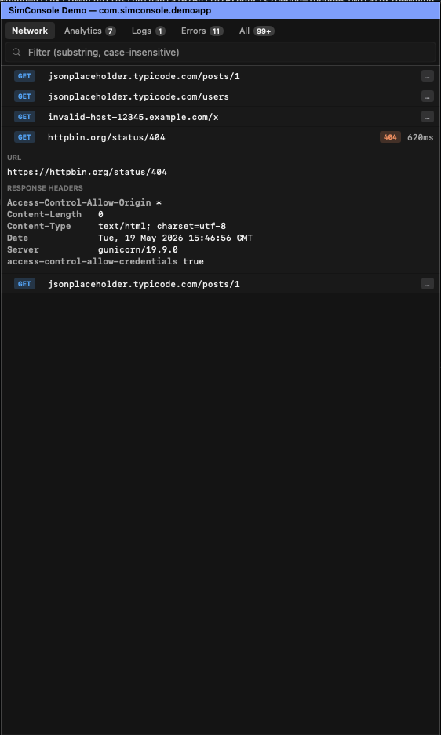
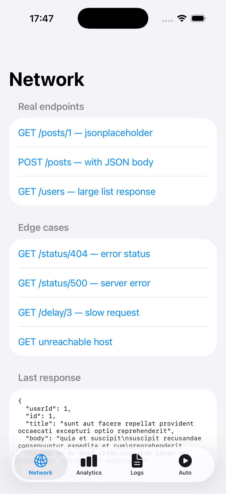

# sim_logs

> **Live structured-log overlay for the iOS Simulator.**
> Charles + Console.app + analytics inspector, in a borderless SwiftUI panel that snaps beside your simulator window.

<p align="center">
  
  &nbsp;
  
</p>

Two independent pieces you can adopt one at a time:

| | |
|---|---|
| **`sim-console`** | macOS app. Borderless SwiftUI panel positioned beside the running iOS Simulator window via the Accessibility API. Subscribes to `xcrun simctl spawn <UDID> log stream` and renders structured rows for analytics + network events, plus text rows for raw logs / errors. |
| **`SimConsole`** | Swift Package (iOS 15+). Drop-in SDK your app calls at runtime to emit structured analytics / network / log events via `os.Logger`. The macOS app picks them up over the unified-log channel — no socket, no port, no extra runtime. |

The two pieces are independent. You can run `sim-console` against **any iOS app** without integrating the SDK — you'll still get the Errors and All text tabs plus CFNetwork-level traffic. Add the SDK and the Analytics and Network tabs become a real Charles-style inspector with method, status, duration, headers, and request + response bodies.

---

## Why

You're running an iOS app on a simulator from the command line (or in CI), and you want:

- **Real-time visibility** into network calls — URL, method, status, duration, headers, body — without launching Charles, Proxyman, or a debugger.
- **Analytics event flow** without fishing in Amplitude/Firebase 30 seconds later — you want to see, *as you tap*, what event fired with what params.
- **Structured logs** that survive `os_log`'s redaction (`<private>` everywhere) and aren't lost in CFNetwork's firehose.
- **Anywhere** — beside any sim, any iOS app, any project. Bundle-id-only configuration.

If you've ever wished Xcode's debug console had a filter bar and a "Network" tab, this is that.

---

## Quickstart

### 1. Run the console beside any iOS simulator

```bash
git clone git@github.com:murilloarturo/sim_logs.git
cd sim_logs

# Build the macOS binary (one-time)
./Tools/build.sh

# Launch beside a booted simulator that has your app installed
./Tools/sim-console.sh <your-bundle-id>
```

On the first run, macOS will prompt for **Accessibility** permission for your terminal — that's how the console finds the simulator window's position. Grant it once.

The console auto-positions beside the simulator window, tracks it as you drag, and exits when Simulator.app quits.

### 2. (Optional) Add the SDK to your iOS app

In Xcode, **File → Add Packages → enter** `https://github.com/murilloarturo/sim_logs` and add the `SimConsole` library to your **Debug-only** target. Or in `Package.swift`:

```swift
.package(url: "https://github.com/murilloarturo/sim_logs", branch: "main")
```

Bootstrap at app launch:

```swift
import SimConsole

@main
struct MyApp: App {
    init() {
        #if DEBUG
        SimConsole.bootstrap(.init(
            subsystem: Bundle.main.bundleIdentifier ?? "com.example.app"
        ))
        #endif
    }
    // ...
}
```

For automatic URLSession capture, register the protocol on every `URLSessionConfiguration` you use:

```swift
#if DEBUG
let config = URLSessionConfiguration.default
config.protocolClasses = [SimConsoleURLProtocol.self] + (config.protocolClasses ?? [])
let session = URLSession(configuration: config)
#endif
```

For analytics, call directly wherever you fire events. Both the dictionary form and typed-model form are supported — they emit identical wire format:

```swift
// Dictionary form — quick and ergonomic
SimConsole.analytics(event: "purchase", params: ["sku": "premium_monthly", "price": 9.99])
SimConsole.screen("CheckoutScreen")
SimConsole.log("Cache miss", level: .info, fields: ["key": "user:profile"])

// Typed-model form — self-documenting, IDE-friendly
SimConsole.track(SimConsole.AnalyticsEvent(
    name: "purchase",
    params: ["sku": "premium_monthly", "price": 9.99]
))
```

Rebuild, launch on a simulator, and run `./Tools/sim-console.sh <your-bundle-id>` — the Analytics and Network tabs light up.

---

## Try the demo app

`Examples/DemoApp/` is a self-contained iOS app that exercises every SDK surface:
real network endpoints, error / slow / unreachable edge cases, analytics + screen events,
log events at every level, and an **Auto** tab that fires activity on a timer so the console
fills up without manual tapping.

```bash
brew install xcodegen           # if not already installed
cd Examples/DemoApp
xcodegen generate
open DemoApp.xcodeproj
# Cmd+R to run on a sim
```

Then in another terminal:

```bash
./Tools/sim-console.sh com.simconsole.demoapp
```

Tap around (or flip the **Auto** tab to running) and watch the console populate.

<p align="center">
  
</p>

---

## What you see

The console has five tabs out of the box:

| Tab | What it shows | Source |
|---|---|---|
| **Network** | Charles-style rows. Method pill (GET/POST/PUT/DELETE, color-coded), URL host + path, status badge (green 2xx / orange 4xx / red 5xx / ERR for connection failures), duration in ms. Tap to expand → URL, request headers + body, response headers + body. Bodies pretty-printed if JSON. | `SimConsole.network(...)` |
| **Analytics** | Per-event rows. `EVT` pill (green) or `SCR` pill (purple) + event name + param count. Tap to expand → full key/value list of params. | `SimConsole.analytics(...)`, `SimConsole.screen(...)` |
| **Logs** | Per-log rows from the `event` category, colored by level (debug dim, info default, warn amber, error red). | `SimConsole.log(...)` |
| **Errors** | Anything from your app's process where `messageType == error OR fault` — catches both `os.Logger.error(...)` and runtime errors that get logged. | Apple unified log |
| **All** | The firehose: every entry your app's process emits. | Apple unified log |

A **search field** at the top filters the active tab by substring across all visible fields (URL, event name, params, body, message).

Buffer: 1000 rows per tab. Older rows are evicted FIFO. Rendering is `LazyVStack` — only visible rows lay out, so scrolling stays smooth regardless of how many entries accumulated.

<p align="center">
  
</p>

---

## Wire format

The SDK emits one JSON object per `os.Logger` call. Network events are split across multiple log entries (one per header, body separately) so a single oversized payload never truncates the meta row.

```jsonc
// Analytics tab
{"kind": "analytics", "t": 1715517600.123, "event": "actionButtonTapped",
 "params": {"step": "1"}, "screen": null}
{"kind": "screen",    "t": ..., "screen": "homeScreen", "params": {}}

// Network tab — paired by `id` across multiple entries
{"kind": "net.request",  "t": ..., "id": "<uuid>", "method": "POST", "url": "https://api.example.com/x"}
{"kind": "net.header",   "t": ..., "id": "<uuid>", "direction": "request",  "name": "Content-Type", "value": "application/json"}
{"kind": "net.body",     "t": ..., "id": "<uuid>", "direction": "request",  "body": "{...}"}
{"kind": "net.response", "t": ..., "id": "<uuid>", "status": 200, "duration_ms": 132, "byte_size": 4096}
{"kind": "net.header",   "t": ..., "id": "<uuid>", "direction": "response", "name": "Content-Type", "value": "application/json"}
{"kind": "net.body",     "t": ..., "id": "<uuid>", "direction": "response", "body": "{...}"}
{"kind": "net.error",    "t": ..., "id": "<uuid>", "duration_ms": 132, "error": "..."}

// Logs tab (generic)
{"kind": "log", "t": ..., "level": "info", "msg": "...", "fields": {...}}
```

All values use `privacy: .public` so the unified-log system doesn't redact them — **never bootstrap this in a Release / App Store build**. The default `#if DEBUG` guard in the integration recipe handles this.

Bodies are clipped to `maxBodyChars` (default 800) so they fit under the unified-log per-line truncation.

---

## How it works

```
┌─────────────────┐                                ┌──────────────────┐
│  Your iOS app   │                                │   sim-console    │
│ (Debug builds)  │                                │  (macOS panel)   │
│                 │                                │                  │
│  SimConsole     │  os.Logger(subsystem:bundleId, │                  │
│   .analytics ───┼─── category:"analytics", ──────┼─►  Analytics tab │
│   .network  ────┼─── category:"network",   ──────┼─►  Network tab   │
│   .log      ────┼─── category:"event")     ──────┼─►  Logs tab      │
│                 │                                │                  │
│  URLSession ────┼─── SimConsoleURLProtocol ──────┘                  │
└─────────────────┘                                │                  │
                                                   │  text streams ◄──┼── xcrun simctl spawn
                                                   │  (Errors, All)   │    log stream
                                                   └──────────────────┘
```

The macOS app launches one `xcrun simctl spawn <UDID> log stream` subprocess per tab, each with its own `NSPredicate`. JSON payloads from the SDK get parsed into typed rows; raw text tabs render the compact-format log line as-is.

No socket, no port collision, no broken-pipe handling. The unified log is the transport.

---

## Project layout

```
sim_logs/
├── Package.swift              ← Swift Package: SimConsole library
├── Sources/SimConsole/        ← SDK (iOS 15+, macOS 11+ for host build)
│   ├── SimConsole.swift
│   ├── SimConsoleURLProtocol.swift
│   └── Models.swift           ← Typed-model overloads
├── Tests/SimConsoleTests/     ← Unit tests
├── Tools/                     ← macOS console
│   ├── sim-console.swift
│   ├── sim-console.sh         ← launcher
│   └── build.sh
└── Examples/DemoApp/          ← Self-contained iOS demo
```

---

## Requirements

- **macOS 13+** for the console binary (uses SwiftUI features).
- **iOS 15+** for the SDK.
- **Xcode 15+** to build the demo.
- One-time **Accessibility** grant for the terminal you launch `sim-console` from (so it can read the Simulator's window position).

---

## FAQ

**Will this slow down my app?**
No measurable impact in Debug builds. The SDK is essentially `os_log` calls with a few dictionary builds. Don't ship it in Release.

**Does it work with Alamofire / Moya / any other networking library?**
Yes, as long as they go through `URLSession` (they all do). Register `SimConsoleURLProtocol` on the session config the library uses, or on `URLSession.shared` globally.

**Why not a TCP socket?**
`os.Logger` already solves the transport problem — it survives backgrounding, sim reboots, port collisions, and works across worktrees. The only cost is `os_log`'s ~1024-byte per-line limit, which we work around by emitting one log entry per header + a separate body event.

**Does it work on a physical device?**
The SDK does (it just writes to `os.Logger`), but `sim-console` only reads simulator logs via `xcrun simctl spawn`. For physical devices, `Console.app`'s device-log view shows the same entries.

**Can I customize tabs?**
Yes — pass `--tab "<kind>|Name|<NSPredicate>"` to `sim-console.sh` (repeatable). `<kind>` is `network`, `analytics`, or `text`. See `./Tools/sim-console.sh --help`.

---

## License

MIT. See [LICENSE](LICENSE).
